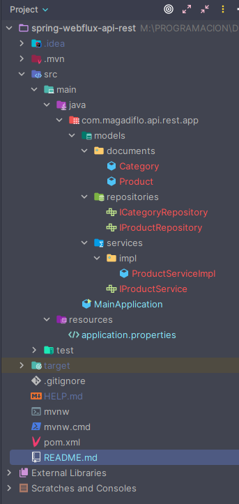

# Sección: API RESTFull usando RestController

---

## Dependencias iniciales

````xml
<!--Spring Boot versión: 3.1.2-->
<!--Java versión: 17-->
<dependencies>
    <dependency>
        <groupId>org.springframework.boot</groupId>
        <artifactId>spring-boot-starter-data-mongodb-reactive</artifactId>
    </dependency>
    <dependency>
        <groupId>org.springframework.boot</groupId>
        <artifactId>spring-boot-starter-validation</artifactId>
    </dependency>
    <dependency>
        <groupId>org.springframework.boot</groupId>
        <artifactId>spring-boot-starter-webflux</artifactId>
    </dependency>

    <dependency>
        <groupId>org.springframework.boot</groupId>
        <artifactId>spring-boot-starter-test</artifactId>
        <scope>test</scope>
    </dependency>
    <dependency>
        <groupId>io.projectreactor</groupId>
        <artifactId>reactor-test</artifactId>
        <scope>test</scope>
    </dependency>
</dependencies>
````

## Creando Proyecto REST

Copiamos las clases, interfaces, propiedades, etc. del proyecto de
[**spring-boot-webflux**](https://github.com/magadiflo/spring-boot-webflux.git) a fin de no empezar desde cero y
**centrarnos en desarrollar la capa REST**, por lo tanto, dejaremos hasta este punto tal como se ve en la imagen:



Como se aprecia, tenemos todas las capas excepto la de **/resources o /controllers**, quien contendrá nuestras clases
controladoras anotadas con @RestController.

## RestController - GET Listar productos

Creamos nuestro controlador del tipo **RestController** y empezamos a implementar los métodos handler empezando por el
método listar:

````java

@RestController
@RequestMapping(path = "/api/v1/products")
public class ProductController {
    private final IProductService productService;

    public ProductController(IProductService productService) {
        this.productService = productService;
    }

    @GetMapping
    public Mono<ResponseEntity<Flux<Product>>> getAllProducts() {
        return Mono.just(ResponseEntity.ok(this.productService.findAll()));
    }
}
````

En el código anterior observamos que el método **getAllProducts()** retorna un ``Mono<ResponseEntity<Flux<Product>>>``,
aunque también habríamos podido implementar ese método de esta manera:

````java

@RestController
@RequestMapping(path = "/api/v1/products")
public class ProductController {
    /* omitted code */

    @GetMapping
    public Flux<Product> getAllProducts() {
        return this.productService.findAll();
    }
}
````

Es decir, ahora se está devolviendo un ``Flux<Product>``, pero ambos métodos tendría el mismo propósito, que es obtener
todos los productos. Sin embargo, difieren en cómo se manejan la respuesta y el tipo de flujo que devuelven. Veamos
cada uno de ellos:

### Primer método

````java
public class ProductController {
    @GetMapping
    public Mono<ResponseEntity<Flux<Product>>> getAllProducts() {
        return Mono.just(ResponseEntity.ok(this.productService.findAll()));
    }
}
````

En este método, estás devolviendo un ``Mono`` que contiene una instancia de  ``ResponseEntity`` que, a su vez, contiene
un ``Flux`` de productos. Esto **significa que estás encapsulando el flujo de productos dentro de una Response Entity**,
lo que te **permite incluir información adicional junto con los datos** (en este caso, el estado de respuesta HTTP,
cabeceras, etc.).

### Segundo método

````java
public class ProductController {
    @GetMapping
    public Flux<Product> getAllProducts() {
        return this.productService.findAll();
    }
}
````

En este segundo método, **simplemente estás devolviendo el flujo de productos directamente.** No estás encapsulando el
flujo en una entidad de respuesta específica. **Esto podría ser útil si** deseas mantener la respuesta más simple y **no
necesitas incluir metadatos adicionales en la respuesta.**

Listo, en mi caso optaré por utilizar aquellas respuestas que incluyen el uso del **ResponseEntity**. Ahora realizamos
una petición al endpoint y vemos su funcionamiento:

````bash
curl -v http://localhost:8080/api/v1/products | jq
>
> --- Respuesta
< HTTP/1.1 200 OK
< 
[
  {
    "id": "64dbee062870a52236cda908",
    "name": "Sony Cámara HD",
    "price": 680.6,
    "createAt": "2023-08-15",
    "image": null,
    "category": {
      "id": "64dbee062870a52236cda903",
      "name": "Electrónico"
    }
  },
  {
    "id": "64dbee062870a52236cda909",
    "name": "Bicicleta Monteñera",
    "price": 1800.6,
    "createAt": "2023-08-15",
    "image": null,
    "category": {
      "id": "64dbee062870a52236cda904",
      "name": "Deporte"
    }
  },
  {...},
 ]
````
