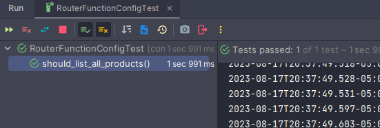

# Sección: API RESTFul usando RestController

---

## Dependencias iniciales

````xml
<!--Spring Boot versión: 3.1.2-->
<!--Java versión: 17-->
<dependencies>
    <dependency>
        <groupId>org.springframework.boot</groupId>
        <artifactId>spring-boot-starter-data-mongodb-reactive</artifactId>
    </dependency>
    <dependency>
        <groupId>org.springframework.boot</groupId>
        <artifactId>spring-boot-starter-validation</artifactId>
    </dependency>
    <dependency>
        <groupId>org.springframework.boot</groupId>
        <artifactId>spring-boot-starter-webflux</artifactId>
    </dependency>

    <dependency>
        <groupId>org.springframework.boot</groupId>
        <artifactId>spring-boot-starter-test</artifactId>
        <scope>test</scope>
    </dependency>
    <dependency>
        <groupId>io.projectreactor</groupId>
        <artifactId>reactor-test</artifactId>
        <scope>test</scope>
    </dependency>
</dependencies>
````

## Creando Proyecto REST

Copiamos las clases, interfaces, propiedades, etc. del proyecto de
[**spring-boot-webflux**](https://github.com/magadiflo/spring-boot-webflux.git) a fin de no empezar desde cero y
**centrarnos en desarrollar la capa REST**, por lo tanto, dejaremos hasta este punto tal como se ve en la imagen:


Como se aprecia, tenemos todas las capas excepto la de **/resources o /controllers**, quien contendrá nuestras clases
controladoras anotadas con @RestController.

## [ResponseEntity](https://docs.spring.io/spring-framework/reference/web/webflux/controller/ann-methods/responseentity.html)

Antes de continuar con la implementación de los endpoints del rest controller, vamos a hablar sobre el `ResponseEntity`.
El `ResponseEntity` es como el `@ResponseBody` pero con `status` y `headers`.

`WebFlux` admite el uso de un tipo reactivo de un solo valor para producir el `ResponseEntity` de manera asíncrona,
y/o tipos reactivos de un solo valor y de múltiples valores para el cuerpo. Esto permite una variedad de respuestas
asíncronas con `ResponseEntity` como sigue:

- `ResponseEntity<Mono<T>>` o `ResponseEntity<Flux<T>>` hacen que el `status` y los `headers` de la respuesta se
  conozcan de inmediato, mientras que el cuerpo se proporciona de manera asíncrona en un momento posterior. Usa `Mono`
  si el cuerpo consiste en 0 a 1 valores, o `Flux` si puede producir múltiples valores.


- `Mono<ResponseEntity<T>>` proporciona los tres: `status` de la respuesta, `headers` y `body`, de manera
  asíncrona en un momento posterior. Esto permite que el `status` y los `headers` de la respuesta varíen según el
  resultado del manejo asíncrono de la solicitud.


- `Mono<ResponseEntity<Mono<T>>>` o `Mono<ResponseEntity<Flux<T>>>` son otra alternativa posible, aunque menos común.
  Proporcionan primero el `status` y los `headers` de la respuesta de manera asíncrona, y luego el cuerpo de la
  respuesta, también de manera asíncrona.

## RestController - GET Listar productos

Creamos nuestro controlador del tipo **RestController** y empezamos a implementar los métodos handler empezando por el
método listar:

````java

@RestController
@RequestMapping(path = "/api/v1/products")
public class ProductController {
    private final IProductService productService;

    public ProductController(IProductService productService) {
        this.productService = productService;
    }

    @GetMapping
    public Mono<ResponseEntity<Flux<Product>>> getAllProducts() {
        return Mono.just(ResponseEntity.ok(this.productService.findAll()));
    }
}
````

En el código anterior observamos que el método **getAllProducts()** retorna un ``Mono<ResponseEntity<Flux<Product>>>``,
aunque también habríamos podido implementar ese método de esta manera:

````java

@RestController
@RequestMapping(path = "/api/v1/products")
public class ProductController {
    /* omitted code */

    @GetMapping
    public Flux<Product> getAllProducts() {
        return this.productService.findAll();
    }
}
````

Es decir, ahora se está devolviendo un ``Flux<Product>``, pero ambos métodos tendría el mismo propósito, que es obtener
todos los productos. Sin embargo, difieren en cómo se manejan la respuesta y el tipo de flujo que devuelven. Veamos
cada uno de ellos:

### Primer método

````java
public class ProductController {
    @GetMapping
    public Mono<ResponseEntity<Flux<Product>>> getAllProducts() {
        return Mono.just(ResponseEntity.ok(this.productService.findAll()));
    }
}
````

En este método, estás devolviendo un ``Mono`` que contiene una instancia de  ``ResponseEntity`` que, a su vez, contiene
un ``Flux`` de productos. Esto **significa que estás encapsulando el flujo de productos dentro de una Response Entity**,
lo que te **permite incluir información adicional junto con los datos** (en este caso, el estado de respuesta HTTP,
cabeceras, etc.).

### Segundo método

````java
public class ProductController {
    @GetMapping
    public Flux<Product> getAllProducts() {
        return this.productService.findAll();
    }
}
````

En este segundo método, **simplemente estás devolviendo el flujo de productos directamente.** No estás encapsulando el
flujo en una entidad de respuesta específica. **Esto podría ser útil si** deseas mantener la respuesta más simple y **no
necesitas incluir metadatos adicionales en la respuesta.**

Listo, en mi caso optaré por utilizar aquellas respuestas que incluyen el uso del **ResponseEntity**. Ahora realizamos
una petición al endpoint y vemos su funcionamiento:

````bash
curl -v http://localhost:8080/api/v1/products | jq
>
> --- Respuesta
< HTTP/1.1 200 OK
< 
[
  {
    "id": "64dbee062870a52236cda908",
    "name": "Sony Cámara HD",
    "price": 680.6,
    "createAt": "2023-08-15",
    "image": null,
    "category": {
      "id": "64dbee062870a52236cda903",
      "name": "Electrónico"
    }
  },
  {
    "id": "64dbee062870a52236cda909",
    "name": "Bicicleta Monteñera",
    "price": 1800.6,
    "createAt": "2023-08-15",
    "image": null,
    "category": {
      "id": "64dbee062870a52236cda904",
      "name": "Deporte"
    }
  },
  {...},
 ]
````

## RestController - GET ver producto

A continuación se muestra la implementación para ver un producto por su id:

````java

@RestController
@RequestMapping(path = "/api/v1/products")
public class ProductController {
    /* omitted code */
    @GetMapping(path = "/{id}")
    public Mono<ResponseEntity<Product>> getProduct(@PathVariable String id) {
        return this.productService.findById(id)
                .map(ResponseEntity::ok)
                .defaultIfEmpty(ResponseEntity.notFound().build());
    }
}
````

Realizamos la petición con un **producto existente:**

````bash
curl -v http://localhost:8080/api/v1/products/64dbf481f239914cea4e43bc | jq

-- Respuesta
< HTTP/1.1 200 OK
{
  "id": "64dbf481f239914cea4e43bc",
  "name": "Colchón Medallón 2 plazas",
  "price": 710,
  "createAt": "2023-08-15",
  "image": null,
  "category": {
    "id": "64dbf481f239914cea4e43ae",
    "name": "Muebles"
  }
}
````

Realizamos la petición con un **producto cuyo id no existe:**

````bash
 curl -v http://localhost:8080/api/v1/products/64dbf481f239914cea4e43bx | jq
 
--- Respuesta
< HTTP/1.1 404 Not Found
````

## RestController - POST crear producto

````java

@RestController
@RequestMapping(path = "/api/v1/products")
public class ProductController {
    /* omitted code */
    @PostMapping
    public Mono<ResponseEntity<Product>> createProduct(@RequestBody Product product) {
        if (product.getCreateAt() == null) {
            product.setCreateAt(LocalDate.now());
        }
        return this.productService.saveProduct(product)
                .map(productDB -> ResponseEntity
                        .created(URI.create("/api/v1/products/" + productDB.getId()))
                        .body(productDB));
    }
}
````

Realizamos la petición para crear un producto:

````bash
curl -v -X POST -H "Content-Type: application/json" -d "{\"name\": \"Vidrio templado\", \"price\": 890.50, \"category\": {\"id\": \"64dbf805a735203c6c342b1f\", \"name\": \"Decoración\"}}" http://localhost:8080/api/v1/products

--- Respuesta
< HTTP/1.1 201 Created
< Location: /api/v1/products/64dbf930a735203c6c342b2e
< Content-Type: application/json
<
{
  "id":"64dbf930a735203c6c342b2e",
  "name":"Vidrio templado",
  "price":890.5,
  "createAt":"2023-08-15",
  "image":null,
  "category":{
    "id":"64dbf805a735203c6c342b1f",
    "name":"Decoración"
    }
}
````

## RestController - PUT actualizar producto

El código implementado para el endpoint de actualizar producto es el siguiente:

````java

@RestController
@RequestMapping(path = "/api/v1/products")
public class ProductController {
    @PutMapping(path = "/{id}")
    public Mono<ResponseEntity<Product>> updateProduct(@PathVariable String id, @RequestBody Product product) {
        return this.productService.findById(id)             // Mono<Product>
                .flatMap(productDB -> {                     // Mono<Product>
                    productDB.setName(product.getName());
                    productDB.setPrice(product.getPrice());
                    productDB.setCategory(product.getCategory());
                    return this.productService.saveProduct(productDB); // Mono<Product>
                })
                .map(ResponseEntity::ok)                    // Mono<ResponseEntity<Product>>
                .defaultIfEmpty(ResponseEntity.notFound().build());
    }
}
````

En este punto es necesario hacer una diferencia entre **flatMap()** y **map()**:

1. ``map`` **en un Mono**, es un operador que se utiliza para **transformar el valor contenido en el Mono en otro
   valor.** En otras palabras, toma el valor actual dentro del Mono y aplica una función a ese valor para producir un
   nuevo valor. **El resultado es un nuevo Mono que contiene el valor transformado.**

   Ahora, tomando como referencia el código anterior vemos que implementamos ``map(ResponseEntity::ok)``, la explicación
   sería: Cuando el flujo llega a ese **map()** llega como un ``Mono<Product>``, luego el map lo que hace es coger el
   valor interno de ese **Mono**, es decir coge el **Product** y lo transforma en su interior; en nuestro caso, lo que
   hacemos con ese **Product** es convertirlo en un **ResponseEntity.ok(product)** o en su defecto la forma abreviada
   sería **ResponseEntity::ok**, finalmente el **map()** retorna un **Mono** del valor transformado, es decir retorna un
   ``Mono<ResponseEntity<Product>>``.


2. ``flatMap`` **en un Mono**, es un operador que se utiliza para transformar el valor contenido en un Mono en otro
   Mono (permitiendo operaciones reactivas anidadas). La diferencia clave entre map y flatMap es que flatMap permite
   trabajar con valores que también son reactivos. **El flatMap se encarga de manejar la "desenvoltura" de los Monos
   anidados. El resultado final es un Mono que contiene el valor transformado.**

   Ahora, tomando como referencia el código anterior vemos que implementamos:
   ````
   .flatMap(productDB -> {                                 // Mono<Product>
        productDB.setName(product.getName());
        productDB.setPrice(product.getPrice());
        productDB.setCategory(product.getCategory());
        return this.productService.saveProduct(productDB); // Mono<Product>
    })
   ````

   Cuando el flujo llega al **flatMap()** llega como un ``Mono<Product>``, lo que hace el **flatMap** es coger el valor
   interno del Mono, o sea coge el **Product**, luego dentro del flatMap **se aplica alguna transformación
   a ese Product** e incluso se utiliza el **productService** para guardar el producto modificado y retorna el valor
   devuelto por el **saveProduct()** que es un ``Mono<Product>``, finalmente lo que hace el **flatMap()** es eliminar
   las múltiples envolturas que puedan haber del Mono, es decir si en vez de flatMap, usáramos el **map()** lo que haría
   ese map, luego de que el **saveProduct()** retorne un ``Mono<Product>`` sería retornar al flujo un
   ``Mono<Mono<Product>>``, es decir lo que está haciendo es envolver la respuesta dada por el **saveProduct()** dentro
   de un **Mono** y eso no queremos, por eso es que usamos el **flatMap()** ya que este se encarga de aplanar la
   respuesta en un solo **Mono**.

Listo, ahora sí actualizamos un producto existente:

````bash
curl -v -X PUT -H "Content-Type: application/json" -d "{\"name\": \"Scooter\", \"price\": 5000.50, \"category\": {\"id\": \"64dbfdc182114c2f7ab5361b\", \"name\": \"Electrónico\"}}" http://localhost:8080/api/v1/products/64dbfdc282114c2f7ab53621 | jq

--- Respuesta
< HTTP/1.1 200 OK
< Content-Type: application/json
{
  "id": "64dbfdc282114c2f7ab53621",
  "name": "Scooter",
  "price": 5000.5,
  "createAt": "2023-08-15",
  "image": null,
  "category": {
    "id": "64dbfdc182114c2f7ab5361b",
    "name": "Electrónico"
  }
}
````

Si tratamos de actualizar un producto que no existe:

````bash
curl -v -X PUT -H "Content-Type: application/json" -d "{\"name\": \"Scooter\", \"price\": 5000.50, \"category\": {\"id\": \"64dbfdc182114c2f7ab5361b\", \"name\": \"Electrónico\"}}" http://localhost:8080/api/v1/products/64dbfdc282114c2f7ab5lkju | jq

--- Respuesta
< HTTP/1.1 404 Not Found
````

## RestController - DELETE eliminar producto

Implementamos el endpoint para eliminar el producto:

````java

@RestController
@RequestMapping(path = "/api/v1/products")
public class ProductController {
    /* omitted code */
    @DeleteMapping(path = "/{id}")
    public Mono<ResponseEntity<Void>> deleteProduct(@PathVariable String id) {
        return this.productService.findById(id)
                .flatMap(productDB -> this.productService.delete(productDB).then(Mono.just(true)))  // (1)
                .map(isDeleted -> new ResponseEntity<Void>(HttpStatus.NO_CONTENT))                  // (2)
                .defaultIfEmpty(ResponseEntity.notFound().build());                                 // (3)
    }
}
````

**(1)** en esa parte del código estamos llamando al  ``this.productService.delete(productDB)`` quien nos retorna un
``Mono<Void>``, precisamente porque nos retorna un ``Mono<Void>`` es que usamos el método **then()** para crear otro
**Mono** que tenga un tipo que no sea **Void**, en mi caso, creé un ``Mono<Boolean>`` para que el flujo continúe en el
siguiente operador **map()**. **¿Qué pasa si no hubiera usado el then(), es decir si solo hubiera retornado el
this.productService.delete(productDB)?**, pues como el método **delete()** retorna un ``Mono<Void>``, le estaríamos
diciendo al flujo que lo que sigue es vacío, por lo tanto, ya no entraría en el operador **map()** sino se pasaría al
operador **defaultIfEmpty()**.

**(2)** usamos el **new** para crear el objeto ResponseEntity indicándole que es **Void**. En este caso no usamos el
método estático como en el **(3)** porque si lo hacemos nos muestra el error diciendo que lo que se está retornando es
un Object: ``Mono<ResponseEntity<Object>>`` y lo que nosotros tenemos que retornar es un ``Mono<ResponseEntity<Void>>``,
eso lo conseguimos con el **new ResponseEntity<Void>()**. Ahora, en el **(3)**, que corresponde al método  
**defaultIfEmpty()** sí acepta la creación del ResponseEntity con el método estático.

Eliminando un producto:

````bash
curl -v -X DELETE http://localhost:8080/api/v1/products/64dc26198f7b916486d2fc2f

--- Respuesta
>
< HTTP/1.1 204 No Content
````

Eliminando nuevamente el mismo producto:

````bash
curl -v -X DELETE http://localhost:8080/api/v1/products/64dc26198f7b916486d2fc2f

--- Respuesta
>
< HTTP/1.1 404 Not Found
````

## Subiendo solo imagen

Implementaremos un endpoint que nos permitirá **subir una imagen en función del id del producto** que pasemos como un
path variable:

````java

@RestController
@RequestMapping(path = "/api/v1/products")
public class ProductController {

    /* omitted code */

    @Value("${config.uploads.path}")
    private String uploadsPath;

    /* omitted code */
    @PostMapping(path = "/upload/{id}")
    public Mono<ResponseEntity<Product>> uploadImage(@PathVariable String id, @RequestPart FilePart imageFile) { // (1)
        return this.productService.findById(id)
                .flatMap(productDB -> {
                    String imageName = UUID.randomUUID().toString() + "-" + imageFile.filename()
                            .replace(" ", "")
                            .replace(":", "")
                            .replace("\\", "");
                    productDB.setImage(imageName);

                    return imageFile.transferTo(new File(this.uploadsPath + productDB.getImage())) // (2)
                            .then(this.productService.saveProduct(productDB));
                })
                .map(ResponseEntity::ok)
                .defaultIfEmpty(ResponseEntity.notFound().build());
    }
}
````

**(1)** del código anterior, vemos que como segundo parámetro usamos ``@RequestPart FilePart imageFile``, donde:

- **FilePart**, es una especialización de ``Part`` que representa un archivo cargado recibido en un request de
  **multipart**. Un ``Part`` es una representación de una parte en un request ``multipart/form-data``. El origen de una
  solicitud **multipart** puede ser un formulario de navegador, en cuyo caso cada parte es un
  **FormFieldPart o FilePart**. Los request multipart también se pueden usar fuera de un navegador para datos de
  cualquier tipo de contenido (por ejemplo, JSON, PDF, etc.).
- **@RequestPart**, anotación que se puede usar para asociar la parte de una solicitud **"multipart/form-data"** con un
  argumento de método.
- **imageFile**, aparte de ser la variable asociada al FilePart, también es el nombre del campo con el que se debe
  enviar la imagen en la solicitud.

**(2)** en el return vemos dos partes, la primera es la ejecución del ``imageFile.transferTo(new File(ruta-e-imagen))``
quien retorna un ``Mono<Void>``, es decir, en esta primera parte nos encargamos de subir la imagen al servidor donde
estará almacenado y una vez finalizado ese proceso el método **transferTo()** retorna un ``Mono<Void>``, por
consiguiente, hasta ese punto finalizó el proceso de subida de imagen, entonces **para continuar con un nuevo flujo**,
en esta segunda parte usamos el ``.then(this.productService.saveProduct(productDB));`` e internamente usamos el servicio
para guarda o actualizar el producto en la base de datos. Como respuesta, el método ``saveProduct(productDB)`` nos
retorna un ``Mono<Product>`` que es lo que finalmente retorna el **flatMap()**.

Podemos utilizar **Postman** para subir la imagen, en el apartado de **Body** seleccionar **form-data**, ingresar el
nombre del campo que almacenará la imagen, en este caso sería **imageFile**, adjuntar la imagen y enviar la solicitud.
En mi caso seguiré usando **curl**, ya que es más fácil tener los comandos que se ejecutan para colocarlos en este
informe:

````bash
curl -v -X POST -H "Content-Type: multipart/form-data" -F "imageFile=@C:\Users\USUARIO\Downloads\bicicleta.png" http://localhost:8080/api/v1/products/upload/64dce9cc4db0da636eb5928d | jq

--- Respuesta
< HTTP/1.1 200 OK
< Content-Type: application/json
<
{
  "id": "64dce9cc4db0da636eb5928d",
  "name": "Bicicleta Monteñera",
  "price": 1800.6,
  "createAt": "2023-08-16",
  "image": "04e7567d-39d7-4f3c-bf12-7010f4961681-bicicleta.png",
  "category": {
    "id": "64dce9cc4db0da636eb59288",
    "name": "Deporte"
  }
}
````

**DONDE**

- **"Content-Type: multipart/form-data"** indica que estás enviando datos de formulario multipartes
- **-F**, especifica el campo **imageFile** que contiene la imagen que deseas cargar. La **-F** significa **"form field"
  o "campo de formulario"**. Específicamente, se utiliza para adjuntar datos en formato multipart/form-data, que es
  comúnmente utilizado para **enviar archivos y campos de formulario** a través de solicitudes HTTP POST.
- El símbolo **@** indica que el valor siguiente debe ser interpretado como un archivo.

## Subiendo imagen junto a su producto

Creamos el método que permitirá subir un producto junto a su imagen al mismo tiempo:

````java

@RestController
@RequestMapping(path = "/api/v1/products")
public class ProductController {
    /* omitted code */
    @PostMapping(path = "/product-with-image")
    public Mono<ResponseEntity<Product>> createProductWithImage(Product product, @RequestPart FilePart imageFile) {
        if (product.getCreateAt() == null) {
            product.setCreateAt(LocalDate.now());
        }

        String imageName = UUID.randomUUID().toString() + "-" + imageFile.filename()
                .replace(" ", "")
                .replace(":", "")
                .replace("\\", "");
        product.setImage(imageName);

        return imageFile.transferTo(new File(this.uploadsPath + product.getImage()))
                .then(this.productService.saveProduct(product)
                        .map(productDB -> ResponseEntity
                                .created(URI.create("/api/v1/products/" + productDB.getId()))
                                .body(productDB))
                );
    }
}
````

No podemos subir los datos del producto como un json, tiene que ser el **Content-Type del request como un form-data**
por eso es que **al primer argumento Product product le quitamos el @RequestBody**.

Cuando mandemos la petición **escribiremos campo por campo todos los pertenecientes a Product y en automático se
mapearán al argumento product**.

La implementación del método **createProductWithImage()** es una fusión de los métodos implementados en
**createProduct() y uploadImage()**.

Ahora, haremos una petición a nuestro endpoint usando curl:

````bash
curl -v -X POST -H "Content-Type: multipart/form-data" -F "name=casa de perrito" -F "price=8900.50" -F "category.id=64dd00a45600b9132d8a4652" -F "category.name=Muebles" -F "imageFile=@C:\Users\USUARIO\Downloads\casa.png" http://localhost:8080/api/v1/products/product-with-image | jq

--- Respuesta
< HTTP/1.1 201 Created
< Location: /api/v1/products/64dd01fd5600b9132d8a4664
< Content-Type: application/json
< Content-Length: 215
{
  "id": "64dd01fd5600b9132d8a4664",
  "name": "casa de perrito",
  "price": 8900.5,
  "createAt": "2023-08-16",
  "image": "b1de00c2-d642-4747-a38c-7ab19e1abf80-casa.png",
  "category": {
    "id": "64dd00a45600b9132d8a4652",
    "name": "Muebles"
  }
````

El parámetro **-F** se utiliza para indicar que **estás adjuntando un campo de formulario en la solicitud POST**. La
abreviación **-F significa "form field" o "campo de formulario"**. Específicamente, se utiliza para adjuntar datos en
formato multipart/form-data, que es comúnmente utilizado para enviar archivos y campos de formulario a través de
solicitudes HTTP POST. En el caso del campo **imageFile** estamos usando el símbolo **@** que indica que el valor
siguiente debe ser interpretado como un archivo.

## Creando método handler con validación

Crearemos un nuevo método para guardar un producto, pero esta vez contendrá validaciones:

````java

@RestController
@RequestMapping(path = "/api/v1/products")
public class ProductController {
    /* omitted code */
    @PostMapping(path = "/create-product-with-validation")
    public Mono<ResponseEntity<Map<String, Object>>> createProductWithValidation(@Valid @RequestBody Mono<Product> productMono) {
        Map<String, Object> response = new HashMap<>();

        return productMono.flatMap(product -> { // (1)
            if (product.getCreateAt() == null) {
                product.setCreateAt(LocalDate.now());
            }
            return this.productService.saveProduct(product)
                    .map(productDB -> {
                        response.put("product", productDB);
                        return ResponseEntity
                                .created(URI.create("/api/v1/products/" + productDB.getId()))
                                .body(response);
                    });
        }).onErrorResume(throwable -> {                                         // (2)
            return Mono.just(throwable)
                    .cast(WebExchangeBindException.class)                       // (3)
                    .flatMap(e -> Mono.just(e.getFieldErrors()))                // (4)
                    .flatMapMany(fieldErrors -> Flux.fromIterable(fieldErrors)) // (5)
                    .map(fieldError -> "El campo " + fieldError.getField() + " " + fieldError.getDefaultMessage()) //(6)
                    .collectList()      // (7)
                    .flatMap(list -> {  // (8)
                        response.put("errors", list);
                        return Mono.just(ResponseEntity.badRequest().body(response));
                    });
        });
    }
}
````

Lo primero que explicaré será esta línea de código:

````
@PostMapping(path = "/create-product-with-validation")
public Mono<ResponseEntity<Map<String, Object>>> createProductWithValidation(@Valid @RequestBody Mono<Product> productMono) {...}
````

- En el código anterior vemos que el tipo de retorno es un `Mono<ResponseEntity<Map<String, Object>>>`, pero fijémonos
  en el `Map<String, Object>`, estamos retornando ese tipo de dato porque dentro de la implementación existen dos
  posibilidades de datos a retornar: **un objeto producto o un objeto lista de strings (cuando ocurra un error de
  validación)**, entonces para unificar la respuesta, creamos el tipo **Map** con el que incluso podríamos agregar las
  respuestas que quisiéramos.


- Usamos la anotación **@Valid** para habilitar la validación del producto.


- Si recordamos el método `createProduct(@RequestBody Product product){...}` veremos que el argumento **product**, es un
  objeto común y corriente al que se le mapeará el objeto json que venga en la petición. Ahora, en nuestro método
  `createProductWithValidation(@Valid @RequestBody Mono<Product> productMono){...}` vemos que el argumento ya no es un
  objeto común y corriente sino más bien un objeto del tipo Reactivo `Mono<Product>`. Es importante definirlo de esa
  forma porque cuando falle la validación del producto, y al ser del tipo reactivo, podemos capturar la excepción y
  manejar el error en el operador `onErrorResume()`.

Ahora, mirando el código interno de nuestro nuevo método podremos ver que el flujo está en dos etapas: (1) cuando todo
es correcto y la (2) cuando ocurre un error:

- **(1)**, utilizando el **productMono** del parámetro realizamos el flujo exitoso para guardar el producto en la BD.
- **(2)**, en caso de que el **productMono** tenga errores utilizamos el método **onErrorResume()** para manejar el
  error.
- **(3)**, el **throwable** como es una excepción muy genérica utilizamos el operador `cast()` para convertirlo en una
  excepción más específica. El tipo de excepción más específica sería `WebExchangeBindException`
- **(4)**, como la excepción nos devuelve un **List de FieldError** utilizamos un **flatMap** para retornar un:
  `Mono<List<FieldError>>`.
- **(5)**, el `List<FieldError>` lo convertiremos a un `Flux<FieldError>` para poder trabajar con cada campo, es por esa
  razón que también usamos el operador **flatMapMany** porque ahora ya no devolverá un **Mono** sino un **Flux**.
- **(6)**, cada campo **FieldError** lo transformamos en un string. El **map()** devolverá un `Flux<String>`.
- **(7)**, convertimos el `Flux<String>` a un `Mono<List<String>>`.
- **(8)**, en el **flatMap()** asignamos la lista de errores al **response** y retornamos un **Mono** del response
  entity.

**IMPORTANTE**

> Como estamos implementando un API REST, y nuestro documento Product tiene un atributo Category y esta Category
> internamente tiene la anotación de validación @NotBlank en su id, entonces **para que ese id de category también se
> valide junto con los otros atributos de producto**, es necesario además de anotar el atributo `category` con `@Valid`
> anotarlo con `@NotNull`, de esa manera, cuando creemos el producto no solo se validarán los atributos de producto,
> sino también los atributos de categoría.

````java

@Document(collection = "products")
public class Product {
    /* omitted code */
    @Valid
    @NotNull
    private Category category;
    /* omitted code*/
}
````

Creando un producto sin enviarle el precio ni la categoría:

````bash
curl -v -X POST -H "Content-Type: application/json" -d "{\"name\": \"Vidrio templado\"}" http://localhost:8080/api/v1/products/create-product-with-validation | jq

--- Respuesta
< HTTP/1.1 400 Bad Request
< Content-Type: application/json
{
  "errors": [
    "El campo category must not be null",
    "El campo price must not be null"
  ]
}
````

Creando un producto sin enviarle el nombre ni la categoría:

````bash
curl -v -X POST -H "Content-Type: application/json" -d "{\"price\": 890.50, \"category\": {}}" http://localhost:8080/api/v1/products/create-product-with-validation | jq

--- Respuesta
< HTTP/1.1 400 Bad Request
< Content-Type: application/json
{
  "errors": [
    "El campo name must not be blank",
    "El campo category.id must not be blank"
  ]
}
````

Creando producto enviándole todos los campos correctos:

````bash
curl -v -X POST -H "Content-Type: application/json" -d "{\"name\": \"Cocina\", \"price\": 890.50, \"category\": {\"id\": \"64dbf805a735203c6c342b1f\", \"name\": \"Decoración\"}}" http://localhost:8080/api/v1/products/create-product-with-validation | jq

--- Respuesta
< HTTP/1.1 201 Created
< Location: /api/v1/products/64dd113194ddbb28b5f2e69a
< Content-Type: application/json
{
  "product": {
    "id": "64dd113194ddbb28b5f2e69a",
    "name": "Cocina",
    "price": 890.5,
    "createAt": "2023-08-16",
    "image": null,
    "category": {
      "id": "64dbf805a735203c6c342b1f",
      "name": "Decoración"
    }
  }
}
````

## Crea producto junto a su imagen y aplica validación

El siguiente endpoint crea un producto en la base de datos junto a una imagen que se le envía por la solicitud. Lo nuevo
en este endpoint es que estamos validando los valores de la entidad producto con la anotación `@Valid`, además notar,
que la variable product de tipo `Product` tiene anotado el `@RequestPart`.

En otras palabras, la línea `@Valid @RequestPart Product product` indica que el campo `product` de la solicitud
`multipart` debe contener un `JSON` con los valores del objeto `Product`. Este `JSON` se deserializa en una instancia
de `Product` y luego se valida según las anotaciones de validación aplicadas a los campos de la clase `Product`.

````java

@RestController
@RequestMapping(path = "/api/v1/products")
public class ProductController {

    /* other codes */

    @PostMapping(path = "/product-with-image-validation")
    public Mono<ResponseEntity<Product>> createProductWithImageAndValidation(@Valid @RequestPart Product product, @RequestPart FilePart imageFile) {
        if (product.getCreateAt() == null) {
            product.setCreateAt(LocalDate.now());
        }

        int extensionIndex = imageFile.filename().lastIndexOf(".");
        String extension = imageFile.filename().substring(extensionIndex);
        String imageName = "%s%s".formatted(UUID.randomUUID().toString(), extension)
                .replace("-", "");

        product.setImage(imageName);

        return imageFile.transferTo(new File(this.uploadsPath + product.getImage()))
                .then(this.productService.saveProduct(product)
                        .map(productDB -> ResponseEntity
                                .created(URI.create("/api/v1/products/" + productDB.getId()))
                                .body(productDB))
                );
    }
}
````

Enviamos una solicitud desde un cliente. Observar que el campo `product` se está enviando un objeto `JSON` que
corresponde a los atributos esperados por el parámetro `product`. El siguiente campo que se le envía es el de
la imagen seleccionada `imageFile`.

Recordar que esta es una solicitud (request) del tipo `multipart`. Esto significa, que cada parte puede tener su propio
tipo de contenido. La anotación `@RequestPart` en Spring Boot se utiliza para indicar que los parámetros del método se
deben extraer de diferentes partes de una solicitud multipart.

En la siguiente petición, vemos una ejecución exitosa.

````bash
$ curl -v -X POST -H "Content-Type: multipart/form-data" -F "product={\"name\": \"Curso de java\", \"price\": 36.60, \"category\": {\"id\": \"66b246f2d357783b00736f7a\", \"name\": \"Muebles\"}};type=application/json" -F "imageFile=@C:\Users\USUARIO\Downloads\images.png" http://localhost:8080/api/v1/products/product-with-image-validation | jq
> POST /api/v1/products/product-with-image-validation HTTP/1.1
> Host: localhost:8080
> User-Agent: curl/8.7.1
> Accept: */*
> Content-Length: 3553
> Content-Type: multipart/form-data; boundary=------------------------YQy0MNzxahzeSd9LTkIgZk
>
< HTTP/1.1 201 Created
< Location: /api/v1/products/66b247bcd357783b00736f8a
< Content-Type: application/json
< Content-Length: 202
<
{
  "id": "66b247bcd357783b00736f8a",
  "name": "Curso de java",
  "price": 36.6,
  "createAt": "2024-08-06",
  "image": "fd1e460f5e714c3bb8adf9ef481874b1.png",
  "category": {
    "id": "66b246f2d357783b00736f7a",
    "name": "Muebles"
  }
}
````

En la siguiente petición vemos que no le estamos enviando el `name` de producto ni el `id` de categoría, por lo tanto,
el backend está aplicando las validaciones correspondientes.

````bash
$ curl -v -X POST -H "Content-Type: multipart/form-data" -F "product={\"price\": 45.50, \"category\": {\"name\": \"Muebles\"}};type=application/json" -F "imageFile=@C:\Users\USUARIO\Downloads\images.png" http://localhost:8080/api/v1/products/product-with-image-validation | jq
>
< HTTP/1.1 400 Bad Request
< Content-Type: application/json
< Content-Length: 1294
<
{
  "timestamp": "2024-08-06T16:01:33.709+00:00",
  "path": "/api/v1/products/product-with-image-validation",
  "status": 400,
  "error": "Bad Request",
  "message": "Validation failed for argument at index 0 in method: public reactor.core.publisher.Mono<org.springframework.http.ResponseEntity<com.magadiflo.api.rest.app.models.documents.Product>> com.magadiflo.api.rest.app.controllers.ProductController.createProductWithImageAndValidation(com.magadiflo.api.rest.app.models.documents.Product,org.springframework.http.codec.multipart.FilePart), with 2 error(s): [Field error in object 'product' on field 'name': rejected value [null]; codes [NotBlank.product.name,NotBlank.name,NotBlank.java.lang.String,NotBlank]; arguments [org.springframework.context.support.DefaultMessageSourceResolvable: codes [product.name,name]; arguments []; default message [name]]; default message [must not be blank]] [Field error in object 'product' on field 'category.id': rejected value [null]; codes [NotBlank.product.category.id,NotBlank.category.id,NotBlank.id,NotBlank.java.lang.String,NotBlank]; arguments [org.springframework.context.support.DefaultMessageSourceResolvable: codes [product.category.id,category.id]; arguments []; default message [category.id]]; default message [must not be blank]] ",
  "requestId": "1b02e89b-1"
}
````

Si estuviéramos trabajando con `Angular`, podríamos construir la petición de la siguiente manera:

````html
<!-- product-form.component.html -->
<form [formGroup]="productForm" (ngSubmit)="onSubmit()">
    <div>
        <label for="name">Name:</label>
        <input id="name" formControlName="name" type="text">
    </div>
    <div>
        <label for="description">Description:</label>
        <input id="description" formControlName="description" type="text">
    </div>
    <div>
        <label for="imageFile">Image File:</label>
        <input id="imageFile" type="file" (change)="onFileSelected($event)">
    </div>
    <button type="submit">Submit</button>
</form>
````

````typescript
// product-form.component.ts
import { Component } from '@angular/core';
import { FormBuilder, FormGroup, Validators } from '@angular/forms';
import { HttpClient } from '@angular/common/http';

@Component({
    selector: 'app-product-form',
    templateUrl: './product-form.component.html'
})
export class ProductFormComponent {
    productForm: FormGroup;
    selectedFile: File | null = null;

    constructor(private fb: FormBuilder, private http: HttpClient) {
        this.productForm = this.fb.group({
            name: ['', Validators.required],
            description: ['', Validators.required]
        });
    }

    onFileSelected(event: Event): void {
        const input = event.target as HTMLInputElement;
        if (input.files && input.files.length > 0) {
            this.selectedFile = input.files[0];
        }
    }

    onSubmit(): void {
        if (this.productForm.invalid || !this.selectedFile) {
            return;
        }

        const formData = new FormData();
        formData.append('product', new Blob([JSON.stringify(this.productForm.value)], { type: 'application/json' }));
        formData.append('imageFile', this.selectedFile);

        this.http.post('/product-with-image-validation', formData).subscribe(response => {
            console.log('Response:', response);
        }, error => {
            console.error('Error:', error);
        });
    }
}
````

---

# Sección: API RESTFul usando Functional EndPoints

---

Otra forma de implementar API REST con WebFlux es utilizando **RouterFunction**, es una forma más liviana, con
programación funcional al 100% y es más reactiva, para ello tenemos que hacer varias configuraciones, entre ellas,
configurar un **RouterFunction** que contenga las rutas de los componentes handler, que se encargan de manejar las
peticiones del API Rest.

## Creando y configurando componentes Router Function y Handler

Crearemos nuestra clase de configuración **RouterFunctionConfig** donde implementaremos el **RouterFunction** y
definiremos la ruta para poder listar los productos:

````java

@Configuration
public class RouterFunctionConfig {

    private final IProductService productService;

    public RouterFunctionConfig(IProductService productService) {
        this.productService = productService;
    }

    @Bean
    public RouterFunction<ServerResponse> routes() {
        return RouterFunctions.route(RequestPredicates.GET("/api/v2/products").or(RequestPredicates.GET("/api/v3/products")), request -> {
            Flux<Product> productFlux = this.productService.findAll();
            return ServerResponse.ok().body(productFlux, Product.class);
        });
    }
}
````

- **RouterFunction**, representa una función que enruta a una functión de controlador (handler).
- El **ServerResponse** representa un tipo de respuesta HTTP de lado del servidor, tal como la devuelve una función de
  handler o una función de filtro.
- El método estático **route()** enruta la solicitud al **handlerFunction** (en nuestro caso el handlerFunction es la
  función anónima o expresión lambda) si se aplica el predicado dado en de la solicitud.
- Podemos definir tantos endpoints para **un mismo handlerFunction** utilizando el operador **or().**
- El **handlerFunction** representa una función que maneja la solicitud, en nuestro caso utilizamos una functión anónima
  o expresión como **handlerFunction**.

Notar que por ahora estamos implementando como **handlerFunction** una función anónima o expresión lambda, pero **la
idea es desacoplar este método handler de esta clase de configuración y llevarlo a una clase distinta**, un componente
que le llamaremos ProductHandler. Pero por ahora veamos el funcionamiento:

````bash
curl -v http://localhost:8080/api/v3/products | jq

--- Respuesta
< HTTP/1.1 200 OK
< transfer-encoding: chunked
< Content-Type: application/json
[
  {
    "id": "64dd42afae2ce5407a7abf01",
    "name": "Sony Cámara HD",
    "price": 680.6,
    "createAt": "2023-08-16",
    "image": null,
    "category": {
      "id": "64dd42aeae2ce5407a7abefc",
      "name": "Electrónico"
    }
  },
  {
    "id": "64dd42afae2ce5407a7abf02",
    "name": "Bicicleta Monteñera",
    "price": 1800.6,
    "createAt": "2023-08-16",
    "image": null,
    "category": {
      "id": "64dd42afae2ce5407a7abefd",
      "name": "Deporte"
    }
  },
  {...}
 ]
````

Ahora mejoremos la legibilidad de la implementación anterior separando los **métodos handler** en una clase de
componente propio y que en nuestra clase de configuración serán usados como **handlerFunctions**.

````java

@Component
public class ProductHandler {

    private final IProductService productService;

    public ProductHandler(IProductService productService) {
        this.productService = productService;
    }

    public Mono<ServerResponse> listAllProducts(ServerRequest request) {
        Flux<Product> productFlux = this.productService.findAll();
        return ServerResponse.ok().body(productFlux, Product.class);
    }
}
````

En el código anterior definimos el método **listAllProducts()** que retorna un `Mono<ServerResponse>` y en el código
siguiente lo utilizamos como un **handlerFunction**:

````java

@Configuration
public class RouterFunctionConfig {

    @Bean
    public RouterFunction<ServerResponse> routes(ProductHandler productHandler) {
        return RouterFunctions.route(RequestPredicates.GET("/api/v2/products").or(RequestPredicates.GET("/api/v3/products")), productHandler::listAllProducts);
    }
}
````

Si probamos el endpoint con esta nueva configuración, esta será la respuesta obtenida:

````bash
curl -v http://localhost:8080/api/v2/products | jq

--- Respuesta
< HTTP/1.1 200 OK
< transfer-encoding: chunked
< Content-Type: application/json
[
  {
    "id": "64dd4e916e9aa45b38025117",
    "name": "Sony Cámara HD",
    "price": 680.6,
    "createAt": "2023-08-16",
    "image": null,
    "category": {
      "id": "64dd4e906e9aa45b38025112",
      "name": "Electrónico"
    }
  },
  {
    "id": "64dd4e916e9aa45b38025118",
    "name": "Bicicleta Monteñera",
    "price": 1800.6,
    "createAt": "2023-08-16",
    "image": null,
    "category": {
      "id": "64dd4e906e9aa45b38025113",
      "name": "Deporte"
    }
  },
  {...}
 ]
````

## RouterFunction - GET ver detalle del producto

La implementación de nuestra función para mostrar el detalle de un producto es el siguiente:

````java

@Component
public class ProductHandler {
    public Mono<ServerResponse> showDetails(ServerRequest request) {
        String id = request.pathVariable("id");
        return this.productService.findById(id)
                .flatMap(productDB -> ServerResponse.ok().bodyValue(productDB))
                .switchIfEmpty(ServerResponse.notFound().build());
    }
}
````

Cuando usamos el RestController para solicitar los datos de un producto, lo que nos retorna el método correspondiente a
ese endpoint es un `Mono<ResponseEntity<Product>>`, en su flujo interno busca el producto utilizando el service
y luego usa el operador **map()** para convertir el producto obtenido en un `Mono<ResponseEntity<Product>>`. En ese caso
usamos el operador **map()** porque el **ResponseEntity no es reactivo**, mientras que en nuestro caso actual
**el ServerResponse sí es reactivo**, por lo tanto, cuando llamamos por ejemplo al
`ServerResponse.ok().body(productFlux,...)` automáticamente el **body()** lo convierte en un `Mono<ServerResponse>`,
por eso debemos usar un **flatMap**, ya que es un tipo reactivo.

**IMPORTANTE**

> Observemos que en el método **listAllProducts()** en el retorno del **body(productFlux)** usamos directamente el Flux
> de producto. Ahora, en el método **showDetails()** en retorno del **bodyValue(productDB)** usamos directamente el
> objeto común de producto, y esto es, porque en este segundo método el objeto **productDB** es un objeto normal, es
> decir, no es ni un Flux ni un Mono, mientras que en el **listAllProducts()** lo que se pasa sí es un objeto reactivo,
> porque es un Flux.
>
> **CONCLUSIÓN:**<br>
> Usar **bodyValue()** para anexar **objetos comunes que no sean ni Flux ni Mono**, y usar **body()** para **objetos
> reactivos como Flux y Mono**, BodyInserters.fromPublisher también sirve, BodyInserters es una alternativa a lo mismo,
> usando una clase y métodos estáticos.

Finalmente implementamos la ruta que apuntará a esta nueva función:

````java

@Configuration
public class RouterFunctionConfig {

    @Bean
    public RouterFunction<ServerResponse> routes(ProductHandler productHandler) {
        return RouterFunctions.route(RequestPredicates.GET("/api/v2/products").or(RequestPredicates.GET("/api/v3/products")), productHandler::listAllProducts)
                .andRoute(RequestPredicates.GET("/api/v2/products/{id}"), productHandler::showDetails); //<-- Ruta implementada en este apartado
    }
}
````

Realizamos la solicitud y vemos el resultado cuando el producto existe:

````bash
curl -v http://localhost:8080/api/v2/products/64dd57be7006723fb52178d4 | jq

--- Respuesta
< HTTP/1.1 200 OK
< Content-Type: application/json
{
  "id": "64dd57be7006723fb52178d4",
  "name": "Sony Cámara HD",
  "price": 680.6,
  "createAt": "2023-08-16",
  "image": null,
  "category": {
    "id": "64dd57be7006723fb52178cf",
    "name": "Electrónico"
  }
}
````

Realizamos la solicitud para ver un producto que no existe:

````bash
curl -v http://localhost:8080/api/v2/products/64dd57be7006723fb5ddddd | jq

--- Respuesta
>
< HTTP/1.1 404 Not Found
< content-length: 0
````

## RouterFunction - POST crear producto

Implementamos el método **handlerFunction** para poder guardar un producto:

````java

@Component
public class ProductHandler {
    /* omitted code */
    public Mono<ServerResponse> createProduct(ServerRequest request) {
        RequestPath requestPath = request.requestPath();
        Mono<Product> productMono = request.bodyToMono(Product.class);
        return productMono
                .flatMap(product -> {
                    if (product.getCreateAt() == null) {
                        product.setCreateAt(LocalDate.now());
                    }
                    return this.productService.saveProduct(product);
                })
                .flatMap(productDB -> ServerResponse
                        .created(URI.create(requestPath.value() + "/" + productDB.getId()))
                        .bodyValue(productDB));
    }
}
````

Del código anterior, **lo que podemos resaltar es la forma cómo obtenemos los datos de la solicitud**. Recordemos que
cuando usamos RestController el parámetro del método lo definimos de esta manera
`createProduct(@RequestBody Product product)`, es decir usamos la anotación **@RequestBody** para que en automático el
objeto json que se manda en la solicitud se pueble en el objeto product.

Ahora, en nuestro caso, como estamos trabajando con **RouterFunction** no usamos la anotación **@RequestBody**, sino que
para obtener los datos del producto enviado por la solicitud debemos usar lo siguiente
`request.bodyToMono(Product.class)`, de esta manera el objeto enviado por la solicitud lo convertiremos a un **Mono**
del tipo **Product**, es por esa razón que le pasamos el **Product.class**.

Ahora toca definir la ruta para crear el producto, esta ruta debe apuntar a nuestro **handlerFunction createProduct()**:

````java

@Configuration
public class RouterFunctionConfig {

    @Bean
    public RouterFunction<ServerResponse> routes(ProductHandler productHandler) {
        return RouterFunctions.route(RequestPredicates.GET("/api/v2/products").or(RequestPredicates.GET("/api/v3/products")), productHandler::listAllProducts)
                .andRoute(RequestPredicates.GET("/api/v2/products/{id}"), productHandler::showDetails)
                .andRoute(RequestPredicates.POST("/api/v2/products"), productHandler::createProduct); //<-- Ruta implementada en este apartado
    }
}
````

Comprobamos el funcionamiento del endpoint:

````bash
curl -v -X POST -H "Content-Type: application/json" -d "{\"name\": \"Vidrio templado\", \"price\": 890.50, \"category\": {\"id\": \"64dd6bd69247a8627fb488e6\", \"name\": \"Decoración\"}}" http://localhost:8080/api/v2/products | jq

--- Respuesta
< HTTP/1.1 201 Created
< Location: /api/v2/products/64dd6c229247a8627fb488f5
< Content-Type: application/json
{
  "id": "64dd6c229247a8627fb488f5",
  "name": "Vidrio templado",
  "price": 890.5,
  "createAt": "2023-08-16",
  "image": null,
  "category": {
    "id": "64dd6bd69247a8627fb488e6",
    "name": "Decoración"
  }
}
````

## RouterFunction - PUT actualizar producto

Implementamos nuestro método **handlerFunction** para actualizar un producto:

````java

@Component
public class ProductHandler {
    /* omitted code */
    public Mono<ServerResponse> updateProduct(ServerRequest request) {
        String id = request.pathVariable("id");
        Mono<Product> productMono = request.bodyToMono(Product.class);
        Mono<Product> productMonoDB = this.productService.findById(id);

        return productMonoDB.zipWith(productMono, (productDB, product) -> {
                    productDB.setName(product.getName());
                    productDB.setPrice(product.getPrice());
                    productDB.setCategory(product.getCategory());
                    return productDB;
                })
                .flatMap(this.productService::saveProduct)
                .flatMap(productDB -> ServerResponse.ok().bodyValue(productDB))
                .switchIfEmpty(ServerResponse.notFound().build());
    }
}
````

Del código anterior podemos resaltar el uso del operador **zipWith()**, `este operador nos permite combinar el resultado
de este mono y otro en un objeto O arbitrario, según lo definido por la función combinadora proporcionada. Un error o
una finalización vacía de cualquier fuente hará que la otra fuente se cancele y el Mono resultante se equivoque o se
complete inmediatamente, respectivamente.`

Definimos la ruta para nuestro handlerFunction **updateProduct()**:

````java

@Configuration
public class RouterFunctionConfig {

    @Bean
    public RouterFunction<ServerResponse> routes(ProductHandler productHandler) {
        return RouterFunctions.route(RequestPredicates.GET("/api/v2/products").or(RequestPredicates.GET("/api/v3/products")), productHandler::listAllProducts)
                .andRoute(RequestPredicates.GET("/api/v2/products/{id}"), productHandler::showDetails)
                .andRoute(RequestPredicates.POST("/api/v2/products"), productHandler::createProduct)
                .andRoute(RequestPredicates.PUT("/api/v2/products/{id}"), productHandler::updateProduct); //<-- Ruta implementada en este apartado
    }
}
````

Actualizamos un producto existente:

````bash
curl -v -X PUT -H "Content-Type: application/json" -d "{\"name\": \"Lamparita\", \"price\": 100, \"category\": {\"id\": \"64de4000b67267238ad2cf1d\", \"name\": \"Muebles\"}}" http://localhost:8080/api/v2/products/64de4000b67267238ad2cf28 | jq
 
--- Respuesta
< HTTP/1.1 200 OK
< Content-Type: application/json
{
  "id": "64de4000b67267238ad2cf28",
  "name": "Lamparita",
  "price": 100,
  "createAt": "2023-08-17",
  "image": null,
  "category": {
    "id": "64de4000b67267238ad2cf1d",
    "name": "Muebles"
  }
}
````

Actualizando un producto que no existe en la base de datos:

````bash
curl -v -X PUT -H "Content-Type: application/json" -d "{\"name\": \"Lamparita\", \"price\": 100, \"category\": {\"id\": \"64de4000b67267238ad2cf1d\", \"name\": \"Muebles\"}}" http://localhost:8080/api/v2/products/55555 | jq

--- Respuesta
< HTTP/1.1 404 Not Found
< content-length: 0
````

## RouterFunction - DELETE eliminar producto

Creamos el **método handlerFunction deleteProduct()** para eliminar un producto:

````java

@Component
public class ProductHandler {
    /* omitted code */
    public Mono<ServerResponse> deleteProduct(ServerRequest request) {
        String id = request.pathVariable("id");

        return this.productService.findById(id)
                .flatMap(productDB -> this.productService.delete(productDB).then(Mono.just(true)))
                .flatMap(isDeleted -> ServerResponse.noContent().build())
                .switchIfEmpty(ServerResponse.notFound().build());
    }
}
````

Del código anterior podemos resaltar este fragmento `this.productService.delete(productDB).then(Mono.just(true))`, lo
que hace el método delete del product service es eliminar el producto y retornar un `Mono<Void>`, pero como ya vimos
en otras secciones (en otros proyectos de este curso), para este caso particular nuestro **flatMap()** no debe retornar
un `Mono<Void>`, pues si lo hace, automáticamente se saltará al operador `switchIfEmpty()` devolviéndonos siempre un
**notFound()** a pesar de que sí eliminó el producto encontrado. Por lo tanto, luego de que el servicio elimine el
producto le concatenamos el `.then()` para iniciar un nuevo flujo, el valor que retorne este nuevo flujo no importa,
solo es como una bandera para que continúe al siguiente **flatMap()**.

Eliminando un producto existente en la base de datos:

````bash
curl -v -X DELETE http://localhost:8080/api/v2/products/64de45243c2dc55512553eb5 | jq

--- Respuesta
< HTTP/1.1 204 No Content
````

Volviendo a eliminar el producto eliminado anteriormente:

````bash
 curl -v -X DELETE http://localhost:8080/api/v2/products/64de45243c2dc55512553eb5 | jq

--- Respuesta
< HTTP/1.1 404 Not Found
````

## RouterFunction - Subiendo solo imagen

Implementamos el handlerFunction para subir una imagen a partir del identificador de un producto:

````java

@Component
public class ProductHandler {
    /* other property */
    private final IProductService productService;
    /* omitted code */

    @Value("${config.uploads.path}")
    private String uploadsPath;

    public Mono<ServerResponse> uploadImageFile(ServerRequest request) {
        String id = request.pathVariable("id");
        Mono<Product> productMonoDB = this.productService.findById(id);

        return request.multipartData()
                .map(MultiValueMap::toSingleValueMap)
                .map(stringPartMap -> stringPartMap.get("imageFile"))
                .cast(FilePart.class)
                .zipWith(productMonoDB, (filePart, productDB) -> {
                    String imageName = UUID.randomUUID().toString() + "-" + filePart.filename()
                            .replace(" ", "")
                            .replace(":", "")
                            .replace("\\", "");
                    productDB.setImage(imageName);

                    return filePart.transferTo(new File(this.uploadsPath + productDB.getImage()))
                            .then(this.productService.saveProduct(productDB));
                })
                .flatMap(productDBMono -> ServerResponse.ok().body(productDBMono, Product.class))
                .switchIfEmpty(ServerResponse.notFound().build());
    }
}
````

Implementamos la ruta para subir el archivo:

````java

@Configuration
public class RouterFunctionConfig {

    @Bean
    public RouterFunction<ServerResponse> routes(ProductHandler productHandler) {
        return RouterFunctions.route(RequestPredicates.GET("/api/v2/products").or(RequestPredicates.GET("/api/v3/products")), productHandler::listAllProducts)
                .andRoute(RequestPredicates.GET("/api/v2/products/{id}"), productHandler::showDetails)
                .andRoute(RequestPredicates.POST("/api/v2/products"), productHandler::createProduct)
                .andRoute(RequestPredicates.PUT("/api/v2/products/{id}"), productHandler::updateProduct)
                .andRoute(RequestPredicates.DELETE("/api/v2/products/{id}"), productHandler::deleteProduct)
                .andRoute(RequestPredicates.POST("/api/v2/products/upload/{id}"), productHandler::uploadImageFile); //<-- Ruta implementada en este apartado
    }
}
````

Subiéndole una imagen a un producto:

````bash
curl -v -X POST -H "Content-Type: multipart/form-data" -F "imageFile=@C:\Users\USUARIO\Downloads\camioneta.png" http://localhost:8080/api/v2/products/upload/64de52f05b9cad1022a48c09 | jq

--- Respuesta
< HTTP/1.1 200 OK
< Content-Type: application/json
{
  "id": "64de52f05b9cad1022a48c09",
  "name": "Pintura Satinado",
  "price": 78,
  "createAt": "2023-08-17",
  "image": "991547dd-24e3-40a9-a303-aa3165cf9f4e-camioneta.png",
  "category": {
    "id": "64de52f05b9cad1022a48c01",
    "name": "Decoración"
  }
}
````

## RouterFunction - Subiendo imagen junto a su producto

Creamos el handlerFunction para crear un producto y al mismo tiempo subir su imagen:

````java

@Component
public class ProductHandler {
    /* omitted code */
    public Mono<ServerResponse> createProductWithImage(ServerRequest request) {
        RequestPath requestPath = request.requestPath();

        Mono<Product> productMono = request.multipartData()
                .map(stringPartMultiValueMap -> {
                    Map<String, Part> singleValueMap = stringPartMultiValueMap.toSingleValueMap();
                    FormFieldPart name = (FormFieldPart) singleValueMap.get("name");
                    FormFieldPart price = (FormFieldPart) singleValueMap.get("price");
                    FormFieldPart categoryId = (FormFieldPart) singleValueMap.get("category.id");
                    FormFieldPart categoryName = (FormFieldPart) singleValueMap.get("category.name");

                    Category category = new Category();
                    category.setId(categoryId.value());
                    category.setName(categoryName.value());

                    return new Product(name.value(), Double.parseDouble(price.value()), category);
                });


        return request.multipartData()
                .map(MultiValueMap::toSingleValueMap)
                .map(stringPartMap -> stringPartMap.get("imageFile"))
                .cast(FilePart.class)
                .zipWith(productMono, (filePart, product) -> {
                    String imageName = UUID.randomUUID().toString() + "-" + filePart.filename()
                            .replace(" ", "")
                            .replace(":", "")
                            .replace("\\", "");
                    product.setImage(imageName);
                    product.setCreateAt(LocalDate.now());

                    return filePart.transferTo(new File(this.uploadsPath + product.getImage()))
                            .then(this.productService.saveProduct(product));
                })
                .flatMap(productDBMono -> productDBMono.flatMap(product -> ServerResponse
                        .created(URI.create(requestPath.value() + "/" + product.getId()))
                        .bodyValue(product)));
    }
}
````

Recordemos lo que vimos en secciones anteriores:
`Un Part es una representación de una parte en un request multipart/form-data. El origen de una
solicitud multipart puede ser un formulario de navegador, en cuyo caso cada parte es un FormFieldPart o FilePart.`
Entonces, en nuestro caso para poder guardar un producto junto a su imagen utilizamos el **multipart/form-data** enviado
desde el cliente (navegador web, postman, etc.). Ahora, en nuestro código anterior separamos en dos partes para poder
obtener, por un lado, los **datos del producto (FormFieldPart)** y, por otro lado, la **imagen enviada para ese producto
(FilePart):**

Miremos más de cerca el código que obtiene cada dato del producto en su correspondiente  **FormFieldPart**. El código
`singleValueMap.get(...)` devuelve la interfaz `Part` que es muy genérica, esta interfaz es una representación de
una parte en una solicitud `multipart/form-data`. Para poder ser más específicos es que esta interfaz `Part` lo
casteamos a un `FormFieldPart` que vendría a ser una **especialización** de Part para un campo de formulario. Una vez
casteado, podemos acceder a su valor utilizando el método **value()**:

````
Mono<Product> productMono = request.multipartData()
    .map(stringPartMultiValueMap -> {
        Map<String, Part> singleValueMap = stringPartMultiValueMap.toSingleValueMap();
        FormFieldPart name = (FormFieldPart) singleValueMap.get("name");
        FormFieldPart price = (FormFieldPart) singleValueMap.get("price");
        FormFieldPart categoryId = (FormFieldPart) singleValueMap.get("category.id");
        FormFieldPart categoryName = (FormFieldPart) singleValueMap.get("category.name");
    
        Category category = new Category();
        category.setId(categoryId.value());
        category.setName(categoryName.value());
    
        return new Product(name.value(), Double.parseDouble(price.value()), category);
    });
````

Ahora observemos el fragmento de la segunda parte donde se obtiene la imagen. Si observamos la línea de código
`stringPartMap.get("imageFile")` vemos que estamos accediendo nombre del campo con el que subimos la imagen, esto nos
retorna la interfaz `Part`, pero al ser muy genérica utilizamos un segundo operador `cast(FilePart.class)` para
castearlo a un `FilePart` ya que es un archivo de imagen. Finalmente, lo que sigue es similar a lo que ya vimos
anteriormente en otros métodos:

````
return request.multipartData()
    .map(MultiValueMap::toSingleValueMap)
    .map(stringPartMap -> stringPartMap.get("imageFile"))
    .cast(FilePart.class)
    .zipWith(productMono, (filePart, product) -> {
        String imageName = UUID.randomUUID().toString() + "-" + filePart.filename()
                .replace(" ", "")
                .replace(":", "")
                .replace("\\", "");
        product.setImage(imageName);
        product.setCreateAt(LocalDate.now());

        return filePart.transferTo(new File(this.uploadsPath + product.getImage()))
                .then(this.productService.saveProduct(product));
    })
    .flatMap(productDBMono -> productDBMono.flatMap(product -> ServerResponse
            .created(URI.create(requestPath.value() + "/" + product.getId()))
            .bodyValue(product)));
````

La ruta para este nuevo handlerFunción será lo siguente:

````java

@Configuration
public class RouterFunctionConfig {

    @Bean
    public RouterFunction<ServerResponse> routes(ProductHandler productHandler) {
        return RouterFunctions.route(RequestPredicates.GET("/api/v2/products").or(RequestPredicates.GET("/api/v3/products")), productHandler::listAllProducts)
                .andRoute(RequestPredicates.GET("/api/v2/products/{id}"), productHandler::showDetails)
                .andRoute(RequestPredicates.POST("/api/v2/products"), productHandler::createProduct)
                .andRoute(RequestPredicates.PUT("/api/v2/products/{id}"), productHandler::updateProduct)
                .andRoute(RequestPredicates.DELETE("/api/v2/products/{id}"), productHandler::deleteProduct)
                .andRoute(RequestPredicates.POST("/api/v2/products/upload/{id}"), productHandler::uploadImageFile)
                .andRoute(RequestPredicates.POST("/api/v2/products/product-with-image"), productHandler::createProductWithImage); //<-- Ruta implementada en este apartado
    }
}
````

Guardando un producto con su imagen:

````bash
curl -v -X POST -H "Content-Type: multipart/form-data" -F "name=casa de Ingeniero" -F "price=200000.00" -F "category.id=64de5e2d977bab27664b01fa" -F "category.name=Decoración" -F "imageFile=@C:\Users\USUARIO\Downloads\casa.png" http://localhost:8080/api/v2/products/product-with-image | jq

--- Respuesta
< HTTP/1.1 201 Created
< Location: /api/v2/products/product-with-image/64de5f02977bab27664b0209
< Content-Type: application/json
{
  "id": "64de5f02977bab27664b0209",
  "name": "casa de Ingeniero",
  "price": 200000,
  "createAt": "2023-08-17",
  "image": "71634d03-2871-4d83-a1f4-08d9cd2a36ea-casa.png",
  "category": {
    "id": "64de5e2d977bab27664b01fa",
    "name": "Decoración"
  }
}
````

## RouterFunction - Creando un handlerFunction con validación

Cuando trabajamos con `@RestController` la validación es más automático, simplemente usamos la anotación `@Valid`
mientras que **aquí, en un handlerFunction, es mucho más manual no tenemos anotaciones**, pero podemos inyectar el
componente de Spring `Validator` y validar de forma manual.

Empezamos creando un nuevo método handlerFunction para crear un producto, pero esta vez agregándole validaciones:

````java

@Component
public class ProductHandler {
    /* omitted property */
    private final Validator validator;

    /* omitted property */

    public ProductHandler(IProductService productService, Validator validator) {
        this.productService = productService;
        this.validator = validator;
    }

    /* omitted code */
    public Mono<ServerResponse> createProductWithValidation(ServerRequest request) {
        RequestPath requestPath = request.requestPath();
        Mono<Product> productMono = request.bodyToMono(Product.class);
        return productMono
                .flatMap(product -> {

                    Errors errors = new BeanPropertyBindingResult(product, Product.class.getName());
                    this.validator.validate(product, errors);

                    if (errors.hasErrors()) {
                        return Flux.fromIterable(errors.getFieldErrors())
                                .map(fieldError -> String.format("[Validación 2] El campo %s %s", fieldError.getField(), fieldError.getDefaultMessage()))
                                .collectList()
                                .flatMap(listStings -> ServerResponse.badRequest().bodyValue(listStings));
                    }

                    if (product.getCreateAt() == null) {
                        product.setCreateAt(LocalDate.now());
                    }
                    return this.productService.saveProduct(product)
                            .flatMap(productDB -> ServerResponse
                                    .created(URI.create(requestPath.value() + "/" + productDB.getId()))
                                    .bodyValue(productDB));
                });
    }
    /* omitted code */
}
````

En el código anterior inyectamos la interface **Validator**, el que precisamente usamos dentro del **flatMap()** para
hacer las validaciones.

Este código es similar al que usamos en el método **createProduct()** que no realiza validación, pero con una pequeña
modificación, mientras que en este nuevo método con validación agregamos este fragmento que lo diferencia:

````
Errors errors = new BeanPropertyBindingResult(product, Product.class.getName());
this.validator.validate(product, errors);

if (errors.hasErrors()) {
    return Flux.fromIterable(errors.getFieldErrors())
            .map(fieldError -> String.format("[Validación 2] El campo %s %s", fieldError.getField(), fieldError.getDefaultMessage()))
            .collectList()
            .flatMap(listStings -> ServerResponse.badRequest().bodyValue(listStings));
}
````

Observamos que luego que se verifica que hay errores, simplemente retornamos un **ServerResponse** con la lista de los
mensajes de errores.

Agregamos la nueva ruta para este handlerFunction:

````java

@Configuration
public class RouterFunctionConfig {

    @Bean
    public RouterFunction<ServerResponse> routes(ProductHandler productHandler) {
        return RouterFunctions.route(RequestPredicates.GET("/api/v2/products").or(RequestPredicates.GET("/api/v3/products")), productHandler::listAllProducts)
                .andRoute(RequestPredicates.GET("/api/v2/products/{id}"), productHandler::showDetails)
                .andRoute(RequestPredicates.POST("/api/v2/products"), productHandler::createProduct)
                .andRoute(RequestPredicates.POST("/api/v2/products/create-product-with-validation"), productHandler::createProductWithValidation) //<-- Ruta implementada en este apartado
                .andRoute(RequestPredicates.PUT("/api/v2/products/{id}"), productHandler::updateProduct)
                .andRoute(RequestPredicates.DELETE("/api/v2/products/{id}"), productHandler::deleteProduct)
                .andRoute(RequestPredicates.POST("/api/v2/products/upload/{id}"), productHandler::uploadImageFile)
                .andRoute(RequestPredicates.POST("/api/v2/products/product-with-image"), productHandler::createProductWithImage);
    }
}
````

Registramos un producto sin el precio ni la categoría:

````bash
curl -v -X POST -H "Content-Type: application/json" -d "{\"name\": \"Cocina\"}" http://localhost:8080/api/v2/products/create-product-with-validation | jq

--- Respuesta
< HTTP/1.1 400 Bad Request
< Content-Type: application/json
[
  "[Validación 2] El campo price must not be null",
  "[Validación 2] El campo category must not be null"
]
````

Registramos un producto sin el nombre ni datos de la categoría:

````bash
curl -v -X POST -H "Content-Type: application/json" -d "{\"price\": 890.50, \"category\": {}}" http://localhost:8080/api/v2/products/create-product-with-validation | jq

--- Response
< HTTP/1.1 400 Bad Request
< Content-Type: application/json
[
  "[Validación 2] El campo name must not be blank",
  "[Validación 2] El campo category.id must not be blank"
]
````

Registramos exitosamente un producto:

````bash
curl -v -X POST -H "Content-Type: application/json" -d "{\"name\": \"Cocina\", \"price\": 890.50, \"category\": {\"id\": \"64de9a2e10d334754fdc6869\", \"name\": \"Decoración\"}}" http://localhost:8080/api/v2/products/create-product-with-validation | jq

--- Respuesta
< HTTP/1.1 201 Created
< Location: /api/v2/products/create-product-with-validation/64de9a7d10d334754fdc6878
< Content-Type: application/json
{
  "id": "64de9a7d10d334754fdc6878",
  "name": "Cocina",
  "price": 890.5,
  "createAt": "2023-08-17",
  "image": null,
  "category": {
    "id": "64de9a2e10d334754fdc6869",
    "name": "Decoración"
  }
}
````

---

# Sección: JUnit: Test a nuestros endpoints usando WebTestClient

---

Para mayor información sobre **Test en Spring Boot** ir al repositorio
[**spring-boot-test**](https://github.com/magadiflo/spring-boot-test.git).

A continuación muestro brevemente la definición de algunas anotaciones y/o propiedades que usaremos en las clases de
test:

- `@SpringBootTest()`, arranca el contexto completo de la aplicación, lo que significa que podemos usar el @Autowired
  para poder usar inyección de dependencia. Inicia un servidor embebido, crea un entorno web y, a continuación, permite
  a los métodos @Test realizar pruebas de integración.
- `webEnvironment = SpringBootTest.WebEnvironment.RANDOM_PORT`, crea un contexto de aplicación web (reactivo o basado en
  servlet) y establece una propiedad de entorno server.port=0 **(que generalmente activa la escucha en un puerto
  aleatorio).** A menudo se usa junto con un campo inyectado @LocalServerPort en la prueba. **Proporciona un entorno web
  real.**
- **WebTestClient**, es un cliente HTTP para probar servidores web, utiliza WebClient internamente para realizar
  solicitudes y, al mismo tiempo, proporciona una API fluida para verificar las respuestas.

## RouterFunction - Test endpoint listar

Realizaremos las pruebas a los endpoints trabajados con **RouterFunction**. Esta forma de trabajar los endpoints nos
obligó a crear las clases `@Configuración RouterFunctionConfig` que contiene los endpoints de las solicitudes http y
su **handlerFunction** correspondiente y la clase `@Component ProductHandler` que contiene la implementación de los
**handlerFunctions**. Teniendo en cuenta lo anterior, crearemos la clase de prueba a partir de la
clase `RouterFunctionConfig` porque contiene los **endpoints** a testear:

````java

@SpringBootTest(webEnvironment = SpringBootTest.WebEnvironment.RANDOM_PORT)
class RouterFunctionConfigTest {
    @Autowired
    private WebTestClient webTestClient;

    @Test
    void should_list_all_products() {
        WebTestClient.ResponseSpec response = this.webTestClient.get().uri("/api/v2/products")
                .accept(MediaType.APPLICATION_JSON)
                .exchange();

        response.expectStatus().isOk()
                .expectHeader().contentType(MediaType.APPLICATION_JSON)
                .expectBodyList(Product.class)
                .hasSize(14);
    }
}
````

Del código anterior podemos ver que **estamos haciendo una petición real**
`(real por esta configuración @SpringBootTest(webEnvironment = SpringBootTest.WebEnvironment.RANDOM_PORT))` al endpoint
que trabajamos en la sección del **RouterFunction**: `/api/v2/products`.

Ejecutamos el test simulando un error:


Ejecutamos el test correctamente:



## RouterFunction - Test endpoint listar usando consumeWith()

Podemos utilizar el **consumeWith()** para que en su interior realicemos las pruebas usando los **Assertions** de
**JUnit**, entonces utilizando el mismo código que hicimos en el apartado anterior realizaremos un pequeño cambio
para utilizar el **consumeWith()**:

````java

@SpringBootTest(webEnvironment = SpringBootTest.WebEnvironment.RANDOM_PORT)
class RouterFunctionConfigTest {
    /* omitted code */
    @Test
    void should_list_all_products_with_consumeWith() {
        WebTestClient.ResponseSpec response = this.webTestClient.get().uri("/api/v2/products")
                .accept(MediaType.APPLICATION_JSON)
                .exchange();

        response.expectStatus().isOk()
                .expectHeader().contentType(MediaType.APPLICATION_JSON)
                .expectBodyList(Product.class)
                .consumeWith(listEntityExchangeResult -> {
                    List<Product> products = listEntityExchangeResult.getResponseBody();

                    Assertions.assertNotNull(products);
                    Assertions.assertFalse(products.isEmpty());
                    Assertions.assertEquals(14, products.size());
                });
    }
}
````

## RouterFunction - Test endpoint ver detalle

Para esta prueba utilizaremos el **jsonPath()** para hacer las comprobaciones. Pero antes es necesario agregar un
método personalizado al repositorio de Producto, ya que siempre que levantemos el proyecto los ids de los productos
almacenados en MongoDB serán aleatorios, no son siempre el mismo, por tal razón es necesario implementar un método
adicional en el repositorio para buscar al producto por su nombre y luego usar su id para hacer la prueba al endpoint
para ver los detalles por id:

A continuación vemos dos formas de crear el método personalizado, uno utilizando el **query method**, es decir la
consulta a la base de datos se hará usando la convención utilizada al nombrar al método y la otra utilizando la
anotación **@Query()** donde definimos la consulta personalizada, en nuestro caso podemos utilizar cualquiera de los
dos:

````java
public interface IProductRepository extends ReactiveMongoRepository<Product, String> {
    Mono<Product> findByName(String name);

    @Query("{'name' : ?0}")
    Mono<Product> findProduct(String name);
}
````

En la interfaz del servicio del producto agregamos un nuevo método:

````java
public interface IProductService {
    /* omitted code */
    Mono<Product> findByName(String name);
}
````

Implementamos el método anterior en el servicio del producto concreto:

````java

@Service
public class ProductServiceImpl implements IProductService {
    /* omitted code */
    @Override
    public Mono<Product> findByName(String name) {
        return this.productRepository.findProduct(name);
    }
}
````

Ahora implementamos nuestro método de prueba:

````java

@SpringBootTest(webEnvironment = SpringBootTest.WebEnvironment.RANDOM_PORT)
class RouterFunctionConfigTest {
    /* omitted property */
    @Autowired
    private IProductService productService;

    /* omitted code */
    @Test
    void should_show_details_of_a_product() {
        Product productDB = this.productService.findByName("Celular Huawey").block();

        WebTestClient.ResponseSpec response = this.webTestClient.get()
                .uri("/api/v2/products/{id}", Collections.singletonMap("id", productDB.getId()))
                .accept(MediaType.APPLICATION_JSON)
                .exchange();

        response.expectStatus().isOk()
                .expectHeader().contentType(MediaType.APPLICATION_JSON)
                .expectBody()
                .jsonPath("$.id").isNotEmpty()
                .jsonPath("$.name").isEqualTo("Celular Huawey");
    }
}
````

## RouterFunction - Test endpoint crear producto

Para poder crear un producto necesitamos previamente los datos de la categoría que ya está almacenado en la base de
datos, por lo tanto, necesitamos crear un método personalizado al igual que en el apartado anterior:

````java
public interface ICategoryRepository extends ReactiveMongoRepository<Category, String> {
    Mono<Category> findByName(String name);
}
````

````java
public interface IProductService {
    /* omitted code */
    Mono<Category> findCategoryByName(String name);
}
````

````java

@Service
public class ProductServiceImpl implements IProductService {
    /* omitted code */
    @Override
    public Mono<Category> findCategoryByName(String name) {
        return this.categoryRepository.findByName(name);
    }
}
````

Finalmente, mostramos el método test para poder validar que el endpoint de crear un producto está funcionando
correctamente:

````java

@SpringBootTest(webEnvironment = SpringBootTest.WebEnvironment.RANDOM_PORT)
class RouterFunctionConfigTest {
    /* omitted code */
    @Test
    void should_create_a_product() {
        Category categoryDB = this.productService.findCategoryByName("Muebles").block();
        Product product = new Product("Escoba", 25.70, categoryDB);

        WebTestClient.ResponseSpec response = this.webTestClient.post()
                .uri("/api/v2/products")
                .contentType(MediaType.APPLICATION_JSON)  //<-- Request
                .accept(MediaType.APPLICATION_JSON)       //<-- Response
                .bodyValue(product)
                .exchange();

        response.expectStatus().isCreated()
                .expectHeader().contentType(MediaType.APPLICATION_JSON)
                .expectBody(Product.class)
                .consumeWith(productEntityExchangeResult -> {
                    Product productTest = productEntityExchangeResult.getResponseBody();

                    Assertions.assertNotNull(productTest);
                    Assertions.assertEquals(product.getName(), productTest.getName());
                    Assertions.assertEquals(product.getPrice(), productTest.getPrice());
                    Assertions.assertNotNull(product.getCategory());
                    Assertions.assertEquals(product.getCategory().getId(), productTest.getCategory().getId());
                    Assertions.assertEquals(product.getCategory().getName(), productTest.getCategory().getName());
                });
    }
}
````

## RouterFunction - Test endpoint actualizar producto

````java

@SpringBootTest(webEnvironment = SpringBootTest.WebEnvironment.RANDOM_PORT)
class RouterFunctionConfigTest {
    /* omitted code */
    @Test
    void should_update_a_product() {
        Product productToUpdateDB = this.productService.findByName("Celular Huawey").block();
        Category categoryDB = this.productService.findCategoryByName("Muebles").block();

        Product productRequest = new Product("Sillón 3 cuerpos", 1600.00, categoryDB);

        WebTestClient.ResponseSpec response = this.webTestClient.put()
                .uri("/api/v2/products/{id}", Collections.singletonMap("id", productToUpdateDB.getId()))
                .contentType(MediaType.APPLICATION_JSON)
                .accept(MediaType.APPLICATION_JSON)
                .bodyValue(productRequest)
                .exchange();

        response.expectStatus().isOk()
                .expectHeader().contentType(MediaType.APPLICATION_JSON)
                .expectBody(Product.class)
                .consumeWith(productEntityExchangeResult -> {
                    Product productTest = productEntityExchangeResult.getResponseBody();

                    Assertions.assertNotNull(productTest);
                    Assertions.assertEquals(productRequest.getName(), productTest.getName());
                    Assertions.assertEquals(productRequest.getPrice(), productTest.getPrice());
                    Assertions.assertNotNull(productRequest.getCategory());
                    Assertions.assertEquals(productRequest.getCategory().getId(), productTest.getCategory().getId());
                    Assertions.assertEquals(productRequest.getCategory().getName(), productTest.getCategory().getName());
                });
    }
}
````

## RouterFunction - Test endpoint eliminar producto

````java

@SpringBootTest(webEnvironment = SpringBootTest.WebEnvironment.RANDOM_PORT)
class RouterFunctionConfigTest {
    /* omitted code */
    @Test
    void should_delete_a_product() {
        Product productDB = this.productService.findByName("Silla de oficina").block();
        WebTestClient.ResponseSpec response = this.webTestClient.delete()
                .uri("/api/v2/products/{id}", Collections.singletonMap("id", productDB.getId()))
                .exchange();

        response.expectStatus().isNoContent()
                .expectBody()
                .isEmpty();
    }
}
````

**NOTA**

> Como los métodos se ejecutan de manera aleatoria, es probable que en alguna ejecución fallen los métodos del listar,
> ya que todos los test están trabajando con los mismos registros de la base de datos, es decir, si primero se ejecuta
> este test de eliminar, disminuirá la cantidad de registros en la base de datos por lo que al momento de ejecutar los
> test de listar productos los assertions fallarán pues no encontrarán la cantidad de productos definidos en esos test.
>
> Pero hasta el momento, he ejecutado los test varias veces y todos han pasado correctamente. No obstante, podríamos
> usar la anotación **@Order** para darle un orden de ejecución a los test y así estar seguros de la ejecución de los
> tests.

## RestController - Métodos test para probar el controlador @RestController

Nos posicionaremos dentro de la clase de controlador **ProductController** y presionando `ctrl + shift + T` damos en
crear un nuevo test para crear la clase de test a partir de este controlador. Una vez creado el archivo de test,
copiamos todos los test desarrollados en el **RouterFunctionConfigTest** y lo pegamos en nuestra nueva clase de test.
Finalmente, **cambiamos la versión del endpoint** `de v2 a v1` para que los test apunten al endpoint definido en nuestro
**ProductController**:

````java

@SpringBootTest(webEnvironment = SpringBootTest.WebEnvironment.RANDOM_PORT)
class ProductControllerTest {
    @Autowired
    private WebTestClient webTestClient;
    @Autowired
    private IProductService productService;

    @Test
    void should_list_all_products() {
        WebTestClient.ResponseSpec response = this.webTestClient.get().uri("/api/v1/products") //<-- Apuntando al endpoint de ProductController
                .accept(MediaType.APPLICATION_JSON)
                .exchange();

        response.expectStatus().isOk()
                .expectHeader().contentType(MediaType.APPLICATION_JSON)
                .expectBodyList(Product.class)
                .hasSize(14);
    }

    @Test
    void should_list_all_products_with_consumeWith() {
        WebTestClient.ResponseSpec response = this.webTestClient.get().uri("/api/v1/products")
                .accept(MediaType.APPLICATION_JSON)
                .exchange();

        response.expectStatus().isOk()
                .expectHeader().contentType(MediaType.APPLICATION_JSON)
                .expectBodyList(Product.class)
                .consumeWith(listEntityExchangeResult -> {
                    List<Product> products = listEntityExchangeResult.getResponseBody();

                    Assertions.assertNotNull(products);
                    Assertions.assertFalse(products.isEmpty());
                    Assertions.assertEquals(14, products.size());
                });
    }

    @Test
    void should_show_details_of_a_product() {
        Product productDB = this.productService.findByName("Celular Huawey").block();

        WebTestClient.ResponseSpec response = this.webTestClient.get()
                .uri("/api/v1/products/{id}", Collections.singletonMap("id", productDB.getId()))
                .accept(MediaType.APPLICATION_JSON)
                .exchange();

        response.expectStatus().isOk()
                .expectHeader().contentType(MediaType.APPLICATION_JSON)
                .expectBody()
                .jsonPath("$.id").isNotEmpty()
                .jsonPath("$.name").isEqualTo("Celular Huawey");
    }

    @Test
    void should_create_a_product() {
        Category categoryDB = this.productService.findCategoryByName("Muebles").block();
        Product product = new Product("Escoba", 25.70, categoryDB);

        WebTestClient.ResponseSpec response = this.webTestClient.post()
                .uri("/api/v1/products")
                .contentType(MediaType.APPLICATION_JSON)        //<-- Request
                .accept(MediaType.APPLICATION_JSON)    //<-- Response
                .bodyValue(product)
                .exchange();

        response.expectStatus().isCreated()
                .expectHeader().contentType(MediaType.APPLICATION_JSON)
                .expectBody(Product.class)
                .consumeWith(productEntityExchangeResult -> {
                    Product productTest = productEntityExchangeResult.getResponseBody();

                    Assertions.assertNotNull(productTest);
                    Assertions.assertEquals(product.getName(), productTest.getName());
                    Assertions.assertEquals(product.getPrice(), productTest.getPrice());
                    Assertions.assertNotNull(product.getCategory());
                    Assertions.assertEquals(product.getCategory().getId(), productTest.getCategory().getId());
                    Assertions.assertEquals(product.getCategory().getName(), productTest.getCategory().getName());
                });
    }

    @Test
    void should_update_a_product() {
        Product productToUpdateDB = this.productService.findByName("Celular Huawey").block();
        Category categoryDB = this.productService.findCategoryByName("Muebles").block();

        Product productRequest = new Product("Sillón 3 cuerpos", 1600.00, categoryDB);

        WebTestClient.ResponseSpec response = this.webTestClient.put()
                .uri("/api/v1/products/{id}", Collections.singletonMap("id", productToUpdateDB.getId()))
                .contentType(MediaType.APPLICATION_JSON)
                .accept(MediaType.APPLICATION_JSON)
                .bodyValue(productRequest)
                .exchange();

        response.expectStatus().isOk()
                .expectHeader().contentType(MediaType.APPLICATION_JSON)
                .expectBody(Product.class)
                .consumeWith(productEntityExchangeResult -> {
                    Product productTest = productEntityExchangeResult.getResponseBody();

                    Assertions.assertNotNull(productTest);
                    Assertions.assertEquals(productRequest.getName(), productTest.getName());
                    Assertions.assertEquals(productRequest.getPrice(), productTest.getPrice());
                    Assertions.assertNotNull(productRequest.getCategory());
                    Assertions.assertEquals(productRequest.getCategory().getId(), productTest.getCategory().getId());
                    Assertions.assertEquals(productRequest.getCategory().getName(), productTest.getCategory().getName());
                });
    }

    @Test
    void should_delete_a_product() {
        Product productDB = this.productService.findByName("Silla de oficina").block();
        WebTestClient.ResponseSpec response = this.webTestClient.delete()
                .uri("/api/v1/products/{id}", Collections.singletonMap("id", productDB.getId()))
                .exchange();

        response.expectStatus().isNoContent()
                .expectBody()
                .isEmpty();
    }

}
````

## Mock - Ejecutando tests en un entorno simulado

**Ejecutaremos los tests sin levantar un servidor real** que esté desplegado en algún puerto HTTP o que haga un request
y response real, sino más bien simular el servidor y por consiguiente simular las request y responses, eso sería
gracias al WebEnvironment.MOCK.

Además, **siempre que usemos WebEnvironment.MOCK debemos acompañarlo con la anotación @AutoConfigureWebTestClient**
para poder importar la autoconfiguración, el contexto de spring.

La anotación **@AutoConfigureWebTestClient se utiliza para configurar un cliente web para realizar solicitudes HTTP
simuladas** al controlador, y @SpringBootTest se utiliza para cargar el contexto de Spring para realizar pruebas de
integración. En este caso, `webEnvironment = SpringBootTest.WebEnvironment.MOCK` indica que **se utilizará un entorno
simulado (mock) en lugar de un servidor web real** para ejecutar las pruebas. En otras palabras, con esa configuración
**Spring Boot no inicia un servidor web real para las pruebas**. En su lugar, crea un contexto de aplicación simulado
que permite realizar pruebas de integración sin la necesidad de un servidor web en funcionamiento. Esto puede ser útil
para realizar pruebas más rápidas y aisladas, ya que no se requiere la infraestructura completa de un servidor web real.

Crearemos una clase de prueba a partir de nuestro controlador ProductController y copiaremos todos los test, tal cual,
lo tenemos en los otras clases de prueba, lo único que cambiará será que agregamos la anotación
`@AutoConfigureWebTestClient` y la configuración de `RANDOM_PORT` la cambiamos a `MOCK`.

````java

@AutoConfigureWebTestClient //<-- Agregamos anotación
@SpringBootTest(webEnvironment = SpringBootTest.WebEnvironment.MOCK) //<-- Cambiamos de RANDOM_PORT a MOCK
class ProductControllerMockTest {

    /**
     * Podemos hacer uso de WebTestClient, teniendo el WebEnvironment.MOCK, 
     * gracias a la anotación @AutoConfigureWebTestClient
     */
    @Autowired
    private WebTestClient webTestClient;

    @Autowired
    private IProductService productService;

    /**
     *  Mismo código que usamos en la clase de prueba
     *  ProductControllerTest o RouterFunctionConfigTest
     */
}
````

### Probando ProductController con  WebEnvironment.RANDOM_PORT

Ejecutamos el test del ProductController como hemos venido trabajando desde el inicio de esta sección donde configuramos
el **WebEnvironment.RANDOM_PORT** y veamos el resultado:


### Probando ProductControllerMockTest con  WebEnvironment.MOCK

Ahora ejecutemos los test donde configuramos el **WebEnvironment.MOCK**:


# Sección: Spring Cloud Eureka Server: Registrando los microservicios

---

Convertiremos este microservicio en un **cliente de eureka para que pueda registrarse en el servidor de eureka**. Para
eso agregaremos la dependencia de **eureka client**:

````xml
<!--Versión Spring Boot: 3.1.2-->
<project>
    <properties>
        <java.version>17</java.version>
        <spring-cloud.version>2022.0.4</spring-cloud.version>
    </properties>
    <dependencies>
        <dependency>
            <groupId>org.springframework.cloud</groupId>
            <artifactId>spring-cloud-starter-netflix-eureka-client</artifactId>
        </dependency>
    </dependencies>
    <dependencyManagement>
        <dependencies>
            <dependency>
                <groupId>org.springframework.cloud</groupId>
                <artifactId>spring-cloud-dependencies</artifactId>
                <version>${spring-cloud.version}</version>
                <type>pom</type>
                <scope>import</scope>
            </dependency>
        </dependencies>
    </dependencyManagement>
</project>
````

Cuando agregamos la dependencia de Eureka Client `spring-cloud-starter-netflix-eureka-client` **automáticamente** el
microservicio **se habilita como un cliente de eureka**. Pero podemos ser explícitos y agregar una anotación en la
clase principal para realizar esa habilitación, pero como se dijo, **tan solo agregando la dependencia ya estamos
habilitándolo**, es decir, usar la anotación **es opcional**.

````java

@EnableDiscoveryClient //<-- (Opcional) Anotación para habilitar una implementación de DiscoveryClient.
@SpringBootApplication
public class MainApplication {

    public static void main(String[] args) {
        SpringApplication.run(MainApplication.class, args);
    }

}
````

**NOTA**

> En el curso de Andrés Guzmán y los cursos que he llevado con **versiones de Spring Boot <2.7.x** se usa la anotación
> `@EnableEurekaClient`, pero en la versión de este proyecto de **Spring Boot 3.1.2 no se encuentra dicha anotación**,
> pero sí está la anotación `@EnableDiscoveryClient` que técnicamente hacen lo mismo, aunque como se mencionó en un
> párrafo anterior, **solo basta con agregar la dependencia en el pom.xml para que el proyecto quede habilitado como un
> cliente de eureka**, por lo que usar la anotación es opcional.

### @EnableEurekaClient vs @EnableDiscoveryClient

- [Fuente: Stack Overflow.](https://stackoverflow.com/questions/31976236/whats-the-difference-between-enableeurekaclient-and-enablediscoveryclient)
  Existen múltiples implementaciones del "Servicio de descubrimiento" **(Discovery Service)** como: eureka, consul,
  zookeeper, etc. `@EnableDiscoveryClient` vive en **spring-cloud-commons** y elige la implementación en el classpath,
  mientras que `@EnableEurekaClient` vive en **spring-cloud-netflix** y **solo funciona para Eureka**, si eureka está en
  su classpath, en realidad ambos son iguales.

- Si está utilizando **Eureka de Netflix, @EnableEurekaClient es específicamente para eso**. Pero si está utilizando
  cualquier otro servicio de descubrimiento, incluido Eureka, puede usar **@EnableDiscoveryClient.**

### Configurando ubicación de Eureka Server

Configurar la ubicación física de **Eureka Server** en nuestro microservicio cliente **es opcional** siempre y cuando el
Servidor de Eureka esté en la misma máquina (localhost) que nuestros microservicios clientes de eureka. Pero **sería
mejor tenerlo configurado de forma explícita**.

Una configuración adicional y requerida es el definirle un nombre a nuestra aplicación de Spring Boot y un puerto:

````properties
spring.application.name=service-product-api-rest
server.port=8080
eureka.client.service-url.defaultZone=http://localhost:8761/eureka
````

## Ejecutando múltiples instancias en IntelliJ IDEA

Para poder ejecutar múltiples instancias usando **IntelliJ IDEA**, realizamos lo siguiente:

````
PRIMERO:
Ejecutamos el proyecto como normalmente lo hacemos. Por ejemplo, se levantará en el puerto 8080 o en 
el puerto que le hayamos definido en el application.properties.

SEGUNDO:
Para ejecutar otra instancia del proyecto, es necesario cambiar el puerto a uno distinto al que se ejecutó en el paso 
anterior, para eso seguimos los siguientes pasos:

PASOS:
- Nos vamos a Edit Configurations...
- En el lado izquierdo seleccionamos la configuración que está ejecutándose con el puerto 8080.
- Clickeamos en Copy Configuration
- Seleccionamos la nueva configuración copiada
- Agregamos un nombre a la configuración: Ejm. MsProductosApplication 9001
- Click en Modify options
- Seleccionamos Add VM options
- Se agregará un nuevo campo de texto. Escribimos el comando para cambiar el puerto
	-Dserver.port=9001
- Apply y OK

Ejecutando nueva instancia
----------------------------
Seleccionamos nuestra nueva configuración y ejecutamos el proyecto.
````

**NOTA**
> Estos pasos se tomaron de un proyecto que ya había realizado antes
> [microservices-project](https://github.com/magadiflo/microservices-project/blob/main/business-domain/ms-productos/README.md)

Listo, de esa manera podemos levantar múltiples instancias del microservicio **spring-webflux-api-rest** a fin de que se
maneje el tema de balanceo de carga, mejor instancia, eureka, etc.
